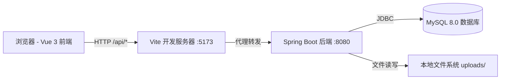
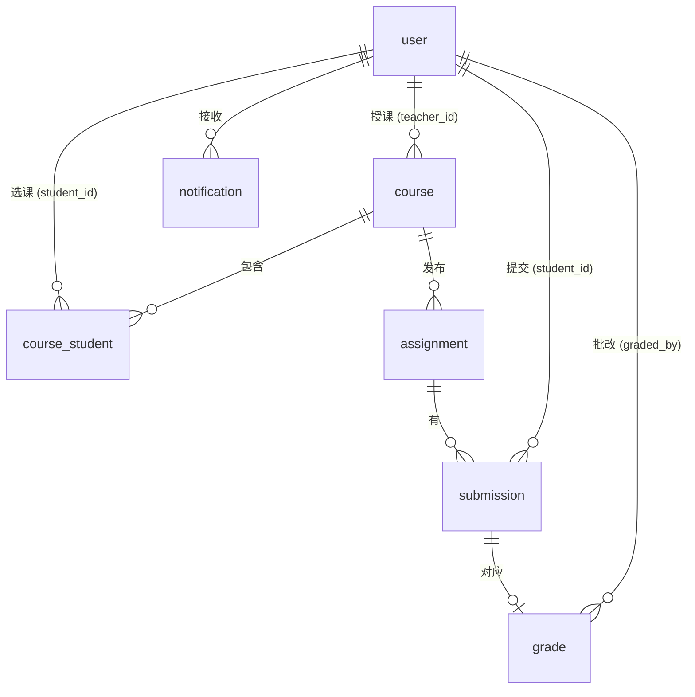
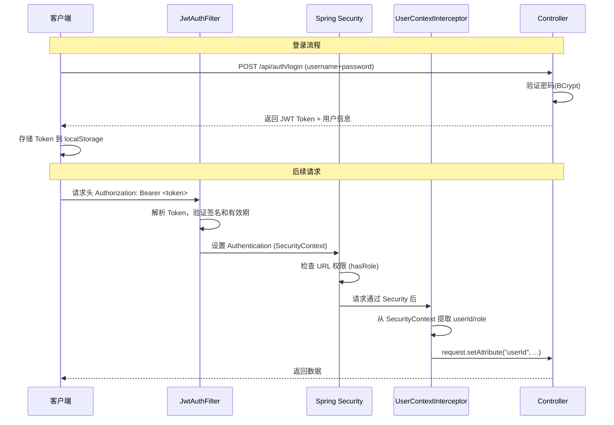

# 高校课程作业提交与批改管理系统 — 项目验收答辩问答手册

> 准备日期：2026-06-22

---

## 目录

1. [项目概述与架构](#一项目概述与架构)
2. [技术栈](#二技术栈)
3. [数据库设计](#三数据库设计)
4. [安全与认证](#四安全与认证)
5. [后端设计](#五后端设计)
6. [前端设计](#六前端设计)
7. [API 设计](#七api-设计)
8. [功能模块](#八功能模块)
9. [MyBatis XML 复杂查询与统计（核心评分点）](#九mybatis-xml-复杂查询与统计核心评分点)
10. [部署运维](#十部署运维)
11. [代码质量与工程实践](#十一代码质量与工程实践)
12. [项目亮点与创新](#十二项目亮点与创新)
13. [不足与改进方向](#十三不足与改进方向)

---

## 一、项目概述与架构

### Q1：请简要介绍一下你的项目。

**答：** 本项目是一个**高校课程作业提交与批改管理系统**，采用**前后端分离架构**。系统支持三种角色：**管理员、教师和学生**。核心功能包括：课程管理、作业发布与提交、在线批改评分、成绩管理、系统通知等。目标是解决传统纸质作业管理效率低、沟通不及时的问题，实现作业管理全流程的数字化和自动化。

---

### Q2：系统的整体架构是怎样的？

**答：** 系统采用 **B/S（浏览器/服务器）前后端分离架构**：



- **前端**：Vue 3 + Element Plus + Pinia + Axios + Vite，运行在 `localhost:5173`
- **后端**：Spring Boot 3.2 + MyBatis + Spring Security + JWT，运行在 `localhost:8080`
- **数据库**：MySQL 8.0，使用 utf8mb4 字符集
- **前后端通信**：RESTful API，JSON 格式，前端通过 Vite 代理转发请求到后端
- **认证方式**：JWT（JSON Web Token）无状态认证

---

### Q3：为什么选择前后端分离架构？

**答：**

1. **职责分离**：前端专注 UI 交互与用户体验，后端专注业务逻辑与数据处理
2. **独立开发与部署**：前后端可并行开发，独立打包部署
3. **可扩展性**：后端 API 可同时服务于 Web 端、移动端等多端
4. **技术选型灵活**：前后端技术栈互不依赖，可各自升级
5. **符合行业趋势**：这是当前业界主流的 Web 应用开发模式

---

### Q4：系统支持哪些用户角色？各有什么权限？

**答：** 系统支持三种角色，权限矩阵如下：

| 功能 | 管理员 (ADMIN) | 教师 (TEACHER) | 学生 (STUDENT) |
|------|:---:|:---:|:---:|
| 用户管理（查看/启禁用） | ✅ | ❌ | ❌ |
| 课程管理（创建/编辑/删除） | ✅ | ✅（仅自己的课程） | ❌ |
| 作业管理（发布/编辑/删除） | ❌ | ✅（仅自己课程的作业） | ❌ |
| 浏览课程与作业 | ✅ | ✅ | ✅（仅已选课程） |
| 选课/退课 | ❌ | ❌ | ✅ |
| 提交作业 | ❌ | ❌ | ✅ |
| 批改评分 | ❌ | ✅（仅自己课程） | ❌ |
| 查看成绩 | ✅ | ✅ | ✅（仅自己的成绩） |
| 个人中心/修改密码 | ✅ | ✅ | ✅ |
| 系统通知 | ✅ | ✅ | ✅ |

---

## 二、技术栈

### Q5：项目使用了哪些技术？为什么选择这些技术？

**答：**

| 层级 | 技术 | 版本 | 选型理由 |
|------|------|------|----------|
| 前端框架 | **Vue 3** | 3.x | 渐进式框架，Composition API 提升代码组织性 |
| UI 组件库 | **Element Plus** | 最新 | 成熟的 Vue 3 桌面端组件库，风格统一 |
| 状态管理 | **Pinia** | 最新 | Vue 官方推荐的状态管理库，TypeScript 友好 |
| HTTP 客户端 | **Axios** | 最新 | 支持请求/响应拦截器，便于统一处理 Token 和错误 |
| 构建工具 | **Vite** | 最新 | 极快的冷启动和 HMR，开发体验优秀 |
| 后端框架 | **Spring Boot 3.2** | 3.2.x | 企业级 Java 框架，生态成熟，自动配置 |
| ORM 框架 | **MyBatis** | 3.0.3 | SQL 可控性强，适合复杂查询场景 |
| 安全框架 | **Spring Security** | 6.x | 成熟的安全框架，支持方法级权限控制 |
| 认证方案 | **JWT (jjwt)** | 0.12.3 | 无状态认证，适合前后端分离架构 |
| 数据库 | **MySQL** | 8.0 | 开源关系型数据库，应用广泛 |
| 简化开发 | **Lombok** | 最新 | 减少模板代码（getter/setter/构造器等） |

---

### Q6：Vue 3 相比 Vue 2 有哪些优势？

**答：**

1. **Composition API**：逻辑复用更灵活，代码组织更清晰（本项目使用 `<script setup>` 语法糖）
2. **更好的 TypeScript 支持**：Vue 3 原生用 TypeScript 重写
3. **性能提升**：更小的打包体积、更快的虚拟 DOM（diff 算法优化）
4. **Teleport、Suspense** 等新内置组件
5. **响应式系统升级**：基于 Proxy 实现，支持更多数据类型

---

### Q7：为什么选择 MyBatis 而不是 JPA/Hibernate？

**答：**

1. **SQL 可控性**：MyBatis 手写 SQL，对复杂查询（多表关联、聚合统计）更灵活
2. **学习曲线**：相比 JPA 的 ORM 映射，MyBatis 更直观
3. **性能优化空间**：可以针对性地编写优化 SQL
4. **本项目特点**：涉及多表关联（课程-学生-作业-提交-成绩），MyBatis 更合适
5. **配合**：使用 `map-underscore-to-camel-case: true` 实现自动驼峰转换

---

### Q8：为什么使用 JWT 而不是传统的 Session？

**答：**

| 对比维度 | JWT | Session |
|----------|-----|---------|
| 存储位置 | 客户端（localStorage） | 服务端（内存/Redis） |
| 扩展性 | 无状态，易于水平扩展 | 需要 Session 共享 |
| 跨域支持 | 天然支持 | 需要额外配置 |
| 移动端友好 | Token 即字符串 | 依赖 Cookie |
| 本项目适配 | 前后端分离 + RESTful | 不适用 |

JWT 更适合前后端分离架构，且无需服务端存储会话状态。

---

## 三、数据库设计

### Q9：数据库有哪些表？它们之间的关系是什么？

**答：** 数据库共 6 张核心表：



**六张表功能说明：**

| 表名 | 说明 | 核心字段 |
|------|------|----------|
| `user` | 用户表 | username, password, role(STUDENT/TEACHER/ADMIN), student_no, teacher_no |
| `course` | 课程表 | name, code, teacher_id(FK→user), semester |
| `course_student` | 选课关联表 | course_id(FK), student_id(FK)，联合唯一约束 |
| `assignment` | 作业表 | course_id(FK), title, deadline, max_score, file_types |
| `submission` | 提交记录表 | assignment_id(FK), student_id(FK), file_path, submit_time, is_late |
| `grade` | 成绩表 | submission_id(FK, UNIQUE), score, comment, graded_by(FK→user) |
| `notification` | 通知表 | user_id(FK), title, content, type, is_read |

---

### Q10：数据库设计有哪些亮点？

**答：**

1. **外键约束完善**：所有关联都设置了外键（`FOREIGN KEY`），保证数据一致性，并设置了级联删除（`ON DELETE CASCADE`）
2. **唯一约束**：用户名、学号、工号、课程编码等都有唯一约束，防止重复数据
3. **字符集**：统一使用 `utf8mb4`，支持 emoji 等特殊字符
4. **索引设计**：外键字段均建立索引，提升查询性能
5. **迟交识别**：`submission` 表的 `is_late` 字段由后端自动计算（比较提交时间与截止时间）
6. **状态管理**：用户、课程、作业、提交都有状态字段，支持软性管理
7. **时间戳自动化**：使用 `DEFAULT CURRENT_TIMESTAMP` 和 `ON UPDATE CURRENT_TIMESTAMP` 自动维护创建和更新时间

---

### Q11：用户密码是如何存储的？

**答：** 使用 **BCrypt 密码编码器**（`BCryptPasswordEncoder`）进行加密存储。BCrypt 有以下优势：

- **自带盐值**：每次加密生成随机盐，同一密码每次哈希结果不同
- **抗暴力破解**：计算成本可配置（默认 10 轮），增加破解难度
- **不可逆**：无法从密文反推明文
- 数据库中存储的是 `$2a$10$...` 格式的密文

验证时使用 `passwordEncoder.matches(rawPassword, encodedPassword)` 方法进行比对。

---

### Q12：如何处理文件上传和存储？

**答：**

1. **存储位置**：上传文件存储在服务端的 `./uploads/` 目录下，按 `年/月/日/` 子目录组织
2. **文件命名**：使用 UUID 重命名，避免文件名冲突
3. **大小限制**：Spring Boot 配置 `max-file-size: 50MB`，`max-request-size: 100MB`
4. **类型限制**：作业创建时可指定允许的文件类型（如 `.pdf,.doc,.zip`），由前端校验
5. **文件下载**：通过 `/api/files/download?filePath=xxx` 接口提供下载，返回 `Content-Disposition: attachment` 头
6. **静态资源映射**：通过 `WebMvcConfig` 配置资源处理器，映射 `/api/files/**` 到实际存储路径

---

## 四、安全与认证

### Q13：系统是如何实现认证与授权的？

**答：** 系统采用 **Spring Security + JWT** 实现认证与授权，流程如下：



**关键组件：**

1. **JwtAuthenticationFilter**：OncePerRequestFilter，从请求头提取并验证 Token，构建 `UsernamePasswordAuthenticationToken`
2. **SecurityConfig**：配置 URL 级别的权限（如 `/api/admin/**` 需要 `ROLE_ADMIN`）
3. **UserContextInterceptor**：从 `SecurityContext` 提取用户信息，设置到 `request.setAttribute`
4. **@PreAuthorize**：控制器方法级权限注解（如 `hasRole('TEACHER')`）

---

### Q14：JWT Token 的结构是怎样的？包含哪些信息？

**答：** JWT Token 包含以下声明（Claims）：

| 声明 | 说明 | 示例 |
|------|------|------|
| `sub` (Subject) | 用户名 | `"student1"` |
| `userId` | 用户 ID | `4` |
| `role` | 用户角色 | `"STUDENT"` |
| `iat` (Issued At) | 签发时间 | `1719000000` |
| `exp` (Expiration) | 过期时间 | `1719086400`（24小时后） |

- **签名算法**：HMAC-SHA256，密钥为 Base64 编码的配置值
- **有效期**：`86400000` 毫秒（24 小时）

---

### Q15：系统有哪些安全措施？

**答：**

1. **密码加密**：BCrypt 不可逆加密存储
2. **JWT 无状态认证**：每次请求都验证 Token 有效性
3. **CORS 配置**：只允许 `http://localhost:*` 来源的跨域请求
4. **CSRF 防护**：由于使用 JWT 无状态认证，已禁用 CSRF（不影响安全性）
5. **URL 权限控制**：`SecurityFilterChain` 中配置了不同路径的访问权限
6. **方法级权限**：使用 `@PreAuthorize` 注解进行细粒度权限控制
7. **防重复提交**：学生同一作业只能提交一次（数据库唯一约束 + 业务层校验）
8. **输入校验**：使用 `@Valid` + Bean Validation 校验请求参数
9. **全局异常处理**：统一处理各类异常，不暴露敏感信息
10. **文件上传安全**：限制文件大小和类型

---

### Q16：Token 过期了怎么办？

**答：** 当前实现中，Token 过期后前端响应拦截器会捕获 401 状态码，自动清除本地存储的 Token 并跳转到登录页面。用户需要重新登录获取新 Token。Token 有效期设置为 24 小时，基本覆盖日常使用场景。后续可考虑引入 **Refresh Token** 机制实现无感刷新。

---

## 五、后端设计

### Q17：后端的包结构是如何组织的？

**答：** 采用经典的**分层架构**：

```
com.courseassignment/
├── common/          # 通用类（Result 统一响应、PageResult 分页）
├── config/          # 配置类（Security、JWT、文件上传、拦截器、全局异常、数据初始化）
├── controller/      # 控制器层（处理 HTTP 请求，调用 Service）
├── dto/             # 数据传输对象（LoginRequest、RegisterRequest、GradeRequest 等）
├── entity/          # 实体类（对应数据库表）
├── mapper/          # MyBatis Mapper 接口（数据访问层）
└── service/         # 服务层接口与实现（业务逻辑）
    └── impl/        # 服务实现类
```

**分层职责：**

| 层 | 职责 |
|-----|------|
| **Controller** | 接收 HTTP 请求，参数校验，调用 Service，返回 Result |
| **Service** | 核心业务逻辑，事务管理（`@Transactional`） |
| **Mapper** | 数据库 CRUD 操作（MyBatis 接口） |
| **Entity** | 数据库表映射，纯数据对象 |
| **DTO** | 接口输入/输出专用对象，与 Entity 分离 |
| **Config** | Spring 配置（Security、CORS、拦截器等） |
| **Common** | 通用工具类（统一响应格式 Result） |

---

### Q18：统一响应格式是如何设计的？

**答：** 所有接口返回统一的 `Result<T>` 格式：

```json
{
  "code": 200,
  "message": "操作成功",
  "data": { ... }
}
```

**状态码规范：**

| Code | 含义 |
|------|------|
| 200 | 操作成功 |
| 400 | 参数校验失败 |
| 401 | 未认证/Token 无效 |
| 403 | 无权限 |
| 404 | 资源不存在 |
| 500 | 服务器内部错误 |

提供静态工厂方法简化使用：`Result.success(data)`、`Result.error("错误信息")`、`Result.unauthorized("...")` 等。

---

### Q19：如何处理异常？

**答：** 使用 `@RestControllerAdvice` 全局异常处理器（`GlobalExceptionHandler`）：

| 异常类型 | 处理方式 | 返回 Code |
|----------|----------|-----------|
| `MethodArgumentNotValidException` | 提取字段校验错误信息 | 400 |
| `RuntimeException` | 业务异常，返回异常消息 | 500 |
| `AccessDeniedException` | 权限不足 | 403 |
| `BadCredentialsException` | 认证失败 | 401 |
| `MaxUploadSizeExceededException` | 文件超限 | 500 |

Service 层抛出的 `RuntimeException`（如"用户名已存在"）会被统一捕获并返回友好提示。

---

### Q20：MyBatis 是如何使用的？

**答：** 采用**纯注解方式**（无 XML 映射文件），特点：

1. **Mapper 接口**：使用 `@Mapper` 注解标记
2. **SQL 注解**：`@Select`、`@Insert`、`@Update`、`@Delete`
3. **驼峰自动转换**：`map-underscore-to-camel-case: true`（数据库 `real_name` → Java `realName`）
4. **参数绑定**：使用 `@Param` 注解绑定多参数
5. **关联查询**：使用 `@Results` + `@Result` 进行结果映射，`@Many` 实现一对多关联
6. **事务管理**：Service 层使用 `@Transactional` 注解管理事务

---

### Q21：服务层是如何保证数据一致性的？

**答：**

1. **事务管理**：所有 Service 实现类标注 `@Transactional`，确保数据库操作的原子性
2. **业务校验**：在关键操作前进行校验（如批改前检查是否已批改、提交前检查是否重复提交）
3. **级联处理**：批改后自动更新提交状态（`SUBMITTED → GRADED`）并发送通知，删除成绩时恢复提交状态
4. **数据库约束**：利用外键、唯一约束在数据库层面兜底

---

## 六、前端设计

### Q22：前端项目结构是怎样的？

**答：**

```
vue_front/src/
├── api/              # API 请求模块（auth.js, course.js, assignment.js 等）
├── assets/           # 静态资源（global.css）
├── components/       # 可复用组件
├── router/           # Vue Router 路由配置
├── stores/           # Pinia 状态管理（user.js）
├── utils/            # 工具函数（request.js Axios 封装）
└── views/            # 页面组件
    ├── admin/        # 管理员页面（Users.vue）
    ├── Dashboard.vue # 首页仪表盘
    ├── Login.vue     # 登录页
    ├── Register.vue  # 注册页
    ├── Layout.vue    # 布局组件（侧边栏+顶部栏）
    ├── Courses.vue   # 课程管理
    ├── Assignments.vue  # 作业管理
    └── ...           # 其他页面
```

---

### Q23：Axios 是如何封装的？

**答：** 在 `utils/request.js` 中创建了 Axios 实例，配置了**请求拦截器**和**响应拦截器**：

**请求拦截器：**
- 自动从 Pinia Store 获取 JWT Token
- 添加到请求头：`Authorization: Bearer <token>`

**响应拦截器：**
- 判断 `res.code !== 200` 时弹出错误提示
- 401 状态码自动清除 Token 并跳转登录页
- 网络异常统一提示"网络错误，请稍后重试"

---

### Q24：路由守卫是如何实现的？

**答：** 使用 `router.beforeEach` 全局前置守卫：

1. **登录校验**：未登录用户访问需要认证的页面 → 重定向到 `/login`
2. **角色校验**：普通用户访问 `/admin/*` → 重定向到首页
3. **反向保护**：已登录用户访问 `/login` 或 `/register` → 重定向到首页
4. **权限路由**：`meta.requiresAdmin`、`meta.requiresTeacher` 控制页面可见性

---

### Q25：状态管理（Pinia）是如何使用的？

**答：** 使用 Pinia 管理用户登录状态（`stores/user.js`）：

- **State**：`token`、`userId`、`username`、`realName`、`role`
- **Getters**：`isLoggedIn`、`isAdmin`、`isTeacher`、`isStudent`
- **Actions**：`login()`、`register()`、`logout()`、`setUserInfo()`
- **持久化**：登录信息同步存储到 `localStorage`，刷新页面不丢失

---

### Q26：前端如何处理跨域问题？

**答：** 开发环境中使用 **Vite 代理**：

```js
// vite.config.js
server: {
  port: 5173,
  proxy: {
    '/api': {
      target: 'http://localhost:8080',
      changeOrigin: true
    }
  }
}
```

前端请求 `/api/xxx` 会被 Vite 开发服务器代理转发到 `http://localhost:8080/api/xxx`，避免跨域问题。同时后端也配置了 CORS（`CorsConfigurationSource`），生产环境中也可正常工作。

---

## 七、API 设计

### Q27：API 接口是如何设计的？

**答：** 遵循 **RESTful API 设计规范**：

| 方法 | 路径 | 说明 |
|------|------|------|
| `POST` | `/api/auth/login` | 用户登录 |
| `POST` | `/api/auth/register` | 用户注册 |
| `GET` | `/api/courses` | 查询课程列表 |
| `GET` | `/api/courses/{id}` | 查询课程详情 |
| `POST` | `/api/teacher/courses` | 创建课程（教师） |
| `PUT` | `/api/teacher/courses/{id}` | 更新课程（教师） |
| `DELETE` | `/api/teacher/courses/{id}` | 删除课程（教师） |
| `GET` | `/api/student/courses` | 我的课程（学生） |
| `POST` | `/api/student/courses/{id}/enroll` | 选课 |
| `DELETE` | `/api/student/courses/{id}/enroll` | 退课 |
| `GET` | `/api/assignments` | 查询作业列表 |
| `POST` | `/api/teacher/assignments` | 发布作业（教师） |
| `POST` | `/api/student/submissions` | 提交作业（学生，multipart/form-data） |
| `POST` | `/api/teacher/grades` | 批改评分（教师） |
| `GET` | `/api/student/grades` | 我的成绩（学生） |
| ... | ... | ... |

**设计原则：**
- URL 命名遵循资源导向（名词复数）
- HTTP 方法表示操作（GET 查询、POST 创建、PUT 更新、DELETE 删除）
- `/api/teacher/*` 和 `/api/student/*` 区分角色接口
- `/api/admin/*` 管理员专属接口
- `/api/auth/*` 和 `/api/public/*` 无需认证

---

## 八、功能模块

### Q28：登录/注册模块的实现细节是什么？

**答：**

**登录流程：**
1. 前端提交 `username` + `password`
2. 后端查询用户 → 检查账号状态 → BCrypt 验证密码
3. 验证通过 → 生成 JWT Token（含 userId、role）→ 返回 Token + 用户信息
4. 前端存储到 Pinia + localStorage → 跳转首页

**注册流程：**
1. 前端提交注册信息（用户名、密码、姓名、角色、学号/工号等）
2. 后端校验唯一性（用户名、学号、工号）→ BCrypt 加密密码 → 插入数据库
3. 注册成功后引导登录（需重新登录）

---

### Q29：作业提交流程是怎样的？

**答：**

1. 学生选择作业 → 上传文件（前端校验文件类型和大小）
2. 后端处理：
   - 检查是否已提交（防重复）
   - 检查作业是否存在且有效（`status=1`）
   - 调用 `FileService` 上传文件到 `uploads/年/月/日/uuid.ext`
   - 比较当前时间与截止时间，自动标记 `is_late`
   - 插入提交记录（`status=SUBMITTED`）
3. 返回提交结果

---

### Q30：作业批改流程是怎样的？

**答：**

1. 教师查看某作业的所有提交 → 选择某学生提交 → 打分 + 写评语
2. 后端处理：
   - 检查提交是否存在
   - 检查是否已批改（防止重复批改）
   - 插入成绩记录 → 更新提交状态为 `GRADED`
   - **自动发送通知**给该学生（标题"作业已批改"，内容含得分）
3. 学生端可实时查看成绩和评语

---

### Q31：系统通知是如何实现的？

**答：**

- **触发时机**：教师批改作业后自动生成通知
- **通知内容**：标题、正文、类型（`GRADE`）、是否已读
- **通知对象**：特定学生（`user_id` 指向学生）
- **查询**：用户登录后查询自己的通知列表，按时间倒序
- **已读标记**：`is_read` 字段标记
- **扩展性**：通知表设计支持 SYSTEM、ASSIGNMENT、GRADE 等多种类型

---

### Q32：首页仪表盘展示了哪些数据？

**答：** 根据用户角色展示不同的统计数据：

| 角色 | 统计卡片 |
|------|----------|
| **管理员** | 用户总数、学生数、教师数、管理员数 |
| **教师** | 教授课程数、发布作业数、待批改数、学生总数 |
| **学生** | 已选课程数、待提交作业数、已提交数、已批改数 |

还包括：
- **快捷操作**：根据角色显示常用功能入口
- **系统公告**：展示系统介绍和使用提示
- **欢迎区**：根据时间段显示不同问候语（上午好/下午好/晚上好）

---

## 九、MyBatis XML 复杂查询与统计（核心评分点）

### Q42：项目中 MyBatis 是否使用了 XML 方式编写复杂查询？

**答：** 是的。项目专门创建了 `StatisticsMapper.xml`（位于 `resources/mapper/`），包含 **15+ 个手写的复杂 SQL 查询**，全部采用 XML 格式，覆盖多表联查、聚合统计、动态SQL、子查询等核心技能。

对应的接口：`com.courseassignment.mapper.StatisticsMapper`
对应的 XML：`classpath:mapper/StatisticsMapper.xml`
对应的 DTO：`dto/CourseStatsDTO`、`StudentGradeSummaryDTO`、`AssignmentStatsDTO`、`TeacherWorkloadDTO`
对应的 Controller：`StatisticsController`（提供 11 个统计 API 接口）

---

### Q43：请举例说明 XML 中实现的一个典型的复杂多表联查。

**答：** 以 **课程综合统计**（`getCourseComprehensiveStats`）为例：

**涉及的表（6 表联查）：**
`course` → `user`（教师） → `assignment` → `submission` → `grade` ⇄ `course_student`

**查询包含的技术点：**

| 技术点 | 具体应用 |
|--------|----------|
| **多表 LEFT JOIN** | course ⟕ user ⟕ assignment ⟕ submission ⟕ grade |
| **嵌套子查询** | `(SELECT COUNT(*) FROM course_student cs WHERE cs.course_id = c.id)` 计算选课人数 |
| **多重聚合函数** | `COUNT(DISTINCT sub.id)`、`AVG(g.score)`、`MAX(g.score)`、`MIN(g.score)` |
| **条件聚合（CASE WHEN）** | `SUM(CASE WHEN sub.is_late = 1 THEN 1 ELSE 0 END)` 计算迟交数 |
| **百分比计算** | `ROUND(COUNT(...) * 100.0 / (...), 1)` 计算提交率、及格率、迟交率 |
| **除法安全处理** | `CASE WHEN ... = 0 THEN 0 ELSE ... END` 防止除零异常 |
| **动态SQL（\<if\>）** | `AND c.teacher_id = #{teacherId}` 可选教师筛选 |
| **动态SQL（\<where\>）** | 自动处理 WHERE 子句 |
| **GROUP BY + HAVING** | `GROUP BY c.id, c.name, ...` |
| **\<resultMap\> 映射** | 完整的 15 字段映射到 `CourseStatsDTO` |

**返回的统计指标：** 选课人数、作业总数、已提交人次、未提交人次、提交率、迟交率、平均分、最高分、最低分、及格率、已批改人次。

---

### Q44：XML 中实现了哪些业务维度的统计查询？

**答：** 共 **4 大维度、15+ 查询**：

| 维度 | 查询方法 | 输出 DTO | 涉及表数 |
|------|----------|----------|:---:|
| **课程统计** | `getCourseComprehensiveStats` | `CourseStatsDTO` | 6 表 |
| **课程统计** | `getSingleCourseStats` | `CourseStatsDTO` | 6 表 |
| **学生统计** | `getStudentGradeSummary` | `StudentGradeSummaryDTO` | 6 表 |
| **学生统计** | `getSingleStudentSummary` | `StudentGradeSummaryDTO` | 6 表 |
| **学生统计** | `getStudentRankingByCourse` | `StudentGradeSummaryDTO` | 4 表 |
| **作业统计** | `getAssignmentStatsByCourse` | `AssignmentStatsDTO` | 6 表 |
| **作业统计** | `getSingleAssignmentStats` | `AssignmentStatsDTO` | 6 表 |
| **教师统计** | `getTeacherWorkloadStats` | `TeacherWorkloadDTO` | 5 表 |
| **教师统计** | `getSingleTeacherWorkload` | `TeacherWorkloadDTO` | 5 表 |
| **仪表盘** | `getSystemOverviewStats` | `Map` | 7 表 |
| **仪表盘** | `getStudentDashboardStats` | `Map` | 4 表 |
| **仪表盘** | `getTeacherDashboardStats` | `Map` | 5 表 |

每个查询都体现出多表联动业务逻辑，不存在单表独立 CRUD。

---

### Q45：请举例说明"分数段分布"是如何在 SQL 中实现的？

**答：** 在 `getSingleAssignmentStats` 查询中，使用 **CASE WHEN 条件聚合**实现五段分数分布：

```sql
SUM(CASE WHEN g.score >= 90 THEN 1 ELSE 0 END)                 AS excellent_count,  -- 优秀 ≥90
SUM(CASE WHEN g.score >= 80 AND g.score < 90 THEN 1 ELSE 0 END) AS good_count,       -- 良好 80-89
SUM(CASE WHEN g.score >= 70 AND g.score < 80 THEN 1 ELSE 0 END) AS medium_count,     -- 中等 70-79
SUM(CASE WHEN g.score >= 60 AND g.score < 70 THEN 1 ELSE 0 END) AS pass_count,       -- 及格 60-69
SUM(CASE WHEN g.score < 60 THEN 1 ELSE 0 END)                   AS fail_count        -- 不及格 <60
```

这段 SQL 在一次查询中完成成绩的**五级分布统计**，对应 `AssignmentStatsDTO` 的 5 个字段，体现了 CASE WHEN 在数据分析中的典型应用。

---

### Q46：提交率、迟交率、批改进度等百分比是如何安全计算的？

**答：** 所有百分比计算都使用 **三层防护**：

1. **CASE WHEN 判断分母为零**：`CASE WHEN COUNT(...) = 0 THEN 0 ELSE ... END`
2. **浮点运算**：`* 100.0`（而非 `* 100`，确保小数精度）
3. **ROUND 取整**：`ROUND(..., 1)` 保留一位小数

示例（提交率计算）：
```sql
ROUND(
    CASE
        WHEN (作业总数 × 选课人数) = 0 THEN 0
        ELSE COUNT(DISTINCT sub.id) * 100.0 / (作业总数 × 选课人数)
    END, 1
) AS submission_rate
```

---

### Q47：现有的基础 Mapper（如 AssignmentMapper、GradeMapper）的查询是单表 CRUD 吗？

**答：** 不是。现有的注解 Mapper 也包含多表联查：

- `AssignmentMapper.findAll`：**LEFT JOIN course** + **子查询统计**提交数和批改数 + **动态SQL**按条件筛选
- `SubmissionMapper.findById`：**5 表 LEFT JOIN**（submission → user → assignment → course → grade）
- `GradeMapper.findById`：**4 表 LEFT JOIN** + 关联字段映射
- `CourseMapper.findAll`：**LEFT JOIN user** + **子查询**计算选课人数 + **动态SQL**关键字搜索

新增的 `StatisticsMapper.xml` 是在此基础上的**深度增强**，增加了聚合统计、分数段分布、百分比计算等分析型查询。

---

### Q48：如何在 XML 中实现动态 SQL？

**答：** 在 `StatisticsMapper.xml` 中使用了 MyBatis 动态 SQL 标签：

| 标签 | 用途 | 示例 |
|------|------|------|
| `<where>` | 动态生成 WHERE 子句，自动去除首个 AND/OR | `WHERE c.teacher_id = #{teacherId}` |
| `<if>` | 条件判断，参数不为空时拼接 | `AND keyword LIKE ...` |
| `<set>` | 动态 UPDATE SET，自动去除尾部逗号 | `SET name = #{name}, updated_at = NOW()` |

---

## 十、部署运维

### Q33：如何部署和运行这个项目？

**答：** 详见《项目部署运行说明书》，简要步骤：

**1. 数据库准备：**
```bash
mysql -u root -p < database.sql
```

**2. 后端启动：**
```bash
cd springboot_back
# 修改 application.yml 中的数据库密码
mvn clean package -DskipTests
java -jar target/course-assignment-system-1.0.0.jar
```

**3. 前端启动：**
```bash
cd vue_front
npm install
npm run dev
```

**4. 访问：** 浏览器打开 `http://localhost:5173`

---

### Q34：项目需要哪些运行环境？

**答：**

| 软件 | 版本要求 |
|------|----------|
| JDK | 17+ |
| Maven | 3.8+ |
| Node.js | 18+ |
| MySQL | 8.0+ |
| 操作系统 | Windows / Linux / macOS |

---

### Q35：前端如何部署到生产环境？

**答：**

```bash
cd vue_front
npm run build
```

构建产物在 `dist/` 目录中，可部署到 Nginx 等 Web 服务器。Nginx 配置示例：

```nginx
server {
    listen 80;
    server_name example.com;

    # 前端静态文件
    location / {
        root /var/www/dist;
        try_files $uri $uri/ /index.html;
    }

    # 代理后端 API
    location /api/ {
        proxy_pass http://localhost:8080;
        proxy_set_header Host $host;
        proxy_set_header X-Real-IP $remote_addr;
    }
}
```

---

## 十一、代码质量与工程实践

### Q36：项目中有哪些代码规范或最佳实践？

**答：**

1. **统一响应格式**：`Result<T>` 统一封装所有 API 响应
2. **DTO 与 Entity 分离**：使用独立的 DTO 类（`LoginRequest`、`GradeRequest` 等）
3. **全局异常处理**：`@RestControllerAdvice` 统一处理异常
4. **参数校验**：使用 `@Valid` + Bean Validation 注解
5. **依赖注入**：使用构造器注入（Spring 推荐方式）
6. **事务管理**：Service 层统一 `@Transactional`
7. **日志规范**：配置 MyBatis SQL 日志输出，方便调试
8. **数据库自动初始化**：`DataInitializer` 启动时检测并插入测试数据
9. **前端模块化**：API 请求按模块拆分（auth.js、course.js 等）
10. **Vue 3 Composition API**：使用 `<script setup>` 语法糖，代码简洁

---

### Q37：项目使用了哪些设计模式？

**答：**

1. **MVC 模式**：Controller → Service → Mapper 三层架构
2. **单例模式**：Spring Bean 默认单例
3. **工厂模式**：`Result` 的静态工厂方法
4. **模板方法模式**：`OncePerRequestFilter`（JWT 过滤器继承）
5. **拦截器模式**：`HandlerInterceptor`（用户上下文拦截器）
6. **代理模式**：Spring AOP（`@Transactional` 事务代理）
7. **策略模式**：`PasswordEncoder` 接口的 BCrypt 实现

---

## 十二、项目亮点与创新

### Q38：这个项目有哪些亮点？

**答：**

1. **完整的前后端分离架构**：Vue 3 + Spring Boot 3.2，技术栈先进
2. **JWT 无状态认证**：支持水平扩展，适合分布式部署
3. **基于角色的访问控制（RBAC）**：三级角色权限管理，URL 级 + 方法级双层控制
4. **自动迟交检测**：提交时自动比较截止时间，无需人工判断
5. **批改自动通知**：批改完成后自动生成系统通知告知学生
6. **数据库自动初始化**：`DataInitializer` + `CommandLineRunner` 启动时自动创建测试数据
7. **统一响应格式**：前后端数据交互规范化
8. **全局异常处理**：用户友好的错误提示
9. **仪表盘数据可视化**：根据不同角色展示个性化统计数据
10. **响应式 UI 设计**：基于 Element Plus，界面美观统一

---

### Q39：相比同类系统，你的项目有什么优势？

**答：**

1. **开箱即用**：提供完整 SQL 脚本和测试数据，导入即可运行
2. **自动化处理**：迟交检测、通知推送、状态同步均为自动
3. **安全性**：BCrypt 加密、JWT 认证、RBAC 权限控制、防重复提交
4. **可维护性**：代码分层清晰，注释完善，前后端模块化
5. **扩展性**：通知系统可扩展（短信/邮件），接口设计支持未来移动端接入

---

## 十三、不足与改进方向

### Q40：项目目前有哪些不足？未来如何改进？

**答：**

| 不足 | 改进方向 |
|------|----------|
| 前端缺少单元测试 | 引入 Vitest + Vue Test Utils |
| 后端缺少集成测试 | 引入 Spring Boot Test + Testcontainers |
| Token 无法主动失效 | 引入 Redis 实现 Token 黑名单 |
| 没有 Refresh Token 机制 | 实现双 Token（Access + Refresh）无感刷新 |
| 文件上传无病毒扫描 | 集成 ClamAV 等安全扫描 |
| 缺少操作日志 | 引入 AOP + 操作日志表记录关键操作 |
| 不支持批量操作 | 增加批量导入学生、批量批改等功能 |
| 没有移动端适配 | 响应式优化或开发小程序版本 |
| 通知方式单一 | 扩展邮件、短信通知渠道 |
| 无数据导出功能 | 支持成绩导出为 Excel/PDF |
| 作业不支持在线预览 | 集成 Office/PDF 在线预览 |

---

### Q41：你在这个项目中学到了什么？

**答：**

1. **前后端分离开发全流程**：从数据库设计到前后端联调
2. **Spring Security + JWT**：深入理解认证授权机制
3. **Vue 3 Composition API**：掌握现代前端开发范式
4. **RESTful API 设计**：资源导向的接口设计思想
5. **分层架构实践**：Controller-Service-Mapper 三层分离的好处
6. **安全性意识**：密码加密、Token 管理、权限控制的重要性
7. **工程化思维**：项目结构规划、异常处理、统一响应等
8. **问题排查能力**：跨域、代理配置、数据库连接等常见问题解决

---

## 附录：测试账号

| 用户名 | 密码 | 角色 |
|--------|------|------|
| `admin` | `123456` | 管理员 |
| `teacher1` | `123456` | 教师 |
| `teacher2` | `123456` | 教师 |
| `student1` | `123456` | 学生 |
| `student2` | `123456` | 学生 |
| `student3` | `123456` | 学生 |

---

> 📝 本文档涵盖了项目验收答辩中可能被问到的各类问题，建议答辩前结合项目代码逐一熟悉。祝答辩顺利！🎓
